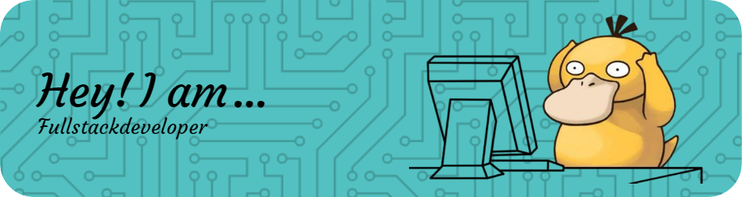

<h1 align="center">
    
</h1>

<h3 align="center">A passionate Fullstack developer from India </h3>

Tech-savvy BTech undergraduate passionate about innovation, seeking an entry-level role to contribute to
cutting-edge projects and deliver exceptional customer experiences.

 

 
 🔭 I’m currently working on my **Visulax** Poject
 
 🌱 I’m currently learning **DSA, DBMS, REST APIs**
 

 

 

  
  

 

 
<h2 align="center">⚒️ Languages-Frameworks-Tools ⚒️</h2>
 

    
     

  <h2 style="color: white;">⚡ Stats ⚡</h2>
   
    

    
  

